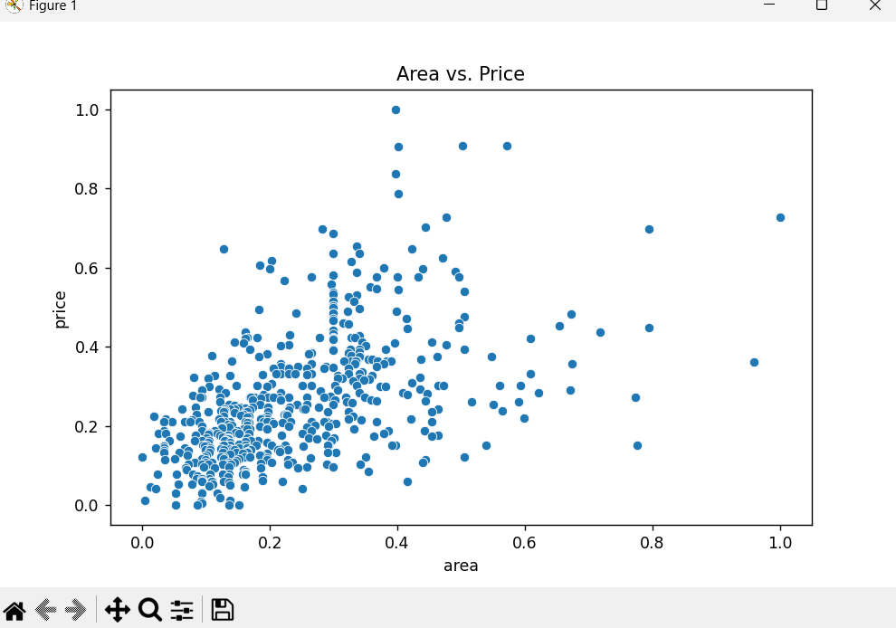
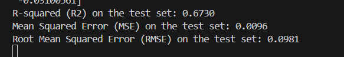

Task 3: Linear Regression

1.Import and preprocess the dataset:
Imported Housing.csv dataset ,we saw the basic details of the file

We scaled object types to numbers 

we performed EDA operations

2.Split data into train-test sets:
we split dataset to 70% training and 30 percent testing.

3.Fit a Linear Regression model using sklearn.linear_model:
created regression model

4.Evaluate model using MAE, MSE, R²:

R-squared is 0.6730 so 67 percent prediction accuracy 
5.Plot regression line and interpret coefficients

